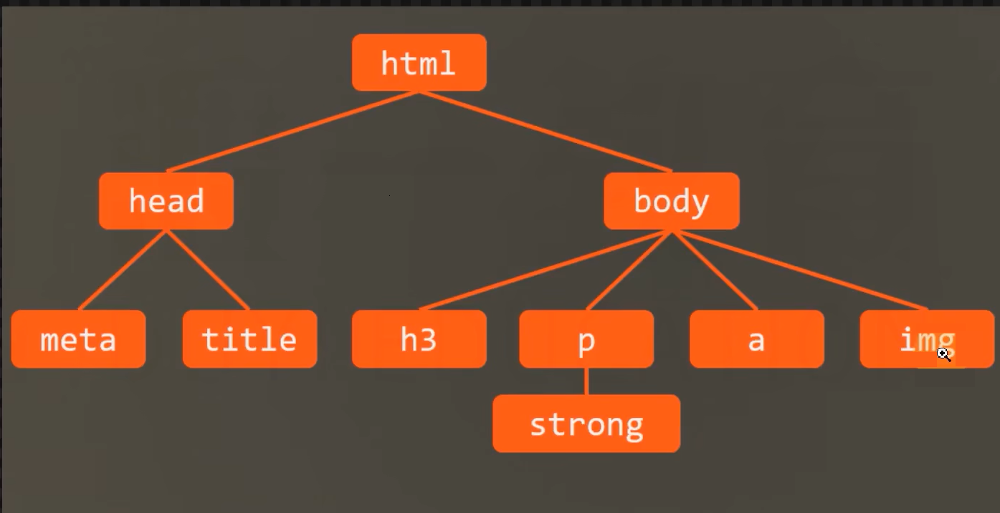
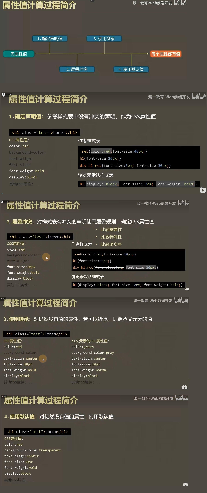

# 为网页添加样式
## 术语解释
```html
<style>
    h1{
        color: red;
        background-color: lightblue;
        text-align: center;
    }
</style>
```
CSS规则 = 选择器 + 声明块
### 选择器
选择器：选中元素
1. ID选择器：选中的是对应 id 值的元素
2. 元素选择器
3. 类选择器
### 声明块
出现在大括号中
声明块中包含很多声明（属性），每个声明（属性）表达了某一方面的样式

## CSS代码书写位置
1. 内部样式表
书写在 style 元素中
2. 内联样式表
直接书写在元素的 style 属性中
3. 外部样式表
将样式书写到独立的css文件中
```html
<link rel="stylesheet" href="./css/index.css">
```
1) 外部样式可以解决多页面样式重复的问题
2) 有利于浏览器缓存，从而提高页面响应速度
3) 有利于代码分离（HTML和CSS），更容易阅读和维护

# 创建的样式声明
## color
元素内部的文字颜色
**预设值**：定义好的颜色单词
**三原色**：色值，红绿蓝
```html
<style>
{
    color:rgb(0, 255, 0);
    color:#ff00ff;
}
</style>
```
## backgroud-color
元素背景颜色
## font-size
元素内部文字的尺寸大小
1）px：像素，文字的高度占多少像素
2）em：相对单位，相对于父元素的字体大小
每个元素必须有字体大小，如果没有声明，则直接使用父元素的字体大小。
如果没有父元素，则使用基准字号（浏览器设置里的字体大小）
> user agent，UA，用户代理（浏览器）
## font-weight
文字粗细程度，可以取值 数字，可以取值 预设值（normal、bord）
> strong元素，默认加粗（strong重要的、不能忽视的内容；em强调的内容）
## font-family
文字类型：微软雅黑、宋体、Arail、sans-serif(非衬线字体类型的集合)
必须用户计算中存在的字体才有效
可以多个联合使用，第一个没有就用下一个：font-family: consolas,宋体,微软雅黑,Arial,sans-serif;
## font-style
字体样式，字体倾斜等样式 italic 等
> i、em 元素，默认样式是 倾斜字体；实际使用中，通常用它表示一个图标
## text-decoration
文本修饰，给文本加条线
中间加条线 line-through，下面加条线 underline 等
> a元素：超链接
> del元素：错误的内容
> s元素：过期的内容
## text-indent
首行文本缩进
text-indent:2em; 缩进2个字符
## line-height
每行文本的高度，该值越大，每行文本的距离越大
设置行高为容器的高度，可以让每行文本垂直居中
行高可以设置为纯数字，表示相对于当前元素的字体大小
## width
元素的宽度
## height
元素的高度
## letter-space
文字的间隙
## text-align
元素内部文字的水平排列方式


# 选择器
## 简单选择器
1. ID选择器
2. 元素选择器
3. 类选择器
4. 通配符选择器
`*`号，选中所有的元素
5. 属性选择器
根据属性名 和 属性值 选择元素
> [用法链接](https://developer.mozilla.org/zh-CN/docs/Web/CSS/Attribute_selectors)
> `https://developer.mozilla.org/zh-CN/docs/Web/CSS/Attribute_selectors`
```css
{
    [href]{
        color:red;
    }
    [href="https://www.sina.com"]{
        color:green;
    }
}
```
6. 伪类选择器（后面都是加个`:`号）
选中某些元素的某种状态（按照以下顺序编写状态样式代码）
1）link：超链接未访问时的状态
2）visited: 超链接访问过后的状态
3）hover：鼠标移动到上方的状态
4）active：激活状态（鼠标按下）
```css
/* 选中鼠标悬停时的 a元素 */
a:hover{
    color: red;
}
/* 鼠标按下时的 a元素 */
a:hover{
    color: #008c8c;
}
```
7. 伪元素选择器
生成并选中某个元素内部的第一个子元素或者最后一个子元素
before
after
```html
<style>
    span::before{
        content: "《";
        color: red;
    }
    span::after{
        content: "》";
        color: blue;
    }
</style>
<p>
    <span>功夫</span>这个电影挺好看
</p>
```
## 选择器的组合
1. 后代元素 —— 空格
```html
<style>
    .red li{
        color: chocolate;
    }
    .red .haha{
        color: green;
    }
</style>
<div class="red">
    <p>Lorem ipsum dolor sit.</p>
    <ul>
        <!-- (li>lorem4)*4 -->
        <li>Lorem ipsum dolor sit.</li>
        <li>Sed harum impedit earum!</li>
        <li class="haha">Dolor hic ratione ea?</li>
        <li>A sapiente qui dolorem.</li>
    </ul>
</div>
```
2. 子元素 —— >
```html
<style>
    .red>ul>.yiyi{
        color: rgb(169, 172, 19);
    }
</style>
<div class="red">
    <ul>
        <!-- (li>lorem4)*4 -->
        <li>Lorem ipsum dolor sit.</li>
        <li>Sed harum impedit earum!</li>
        <li class="haha">Dolor hic ratione ea?</li>
        <li>A sapiente qui dolorem.</li>
    </ul>
</div>
```
3. 相邻兄弟元素 —— +
相邻的后面一个兄弟元素
```html
<style>
    .haha+li{
        color: red;
    }
</style>
<div>
    <ul>
        <!-- (li>lorem4)*4 -->
        <li>Lorem ipsum dolor sit.</li>
        <li class="haha">Sed harum impedit earum!</li>
        <li>Dolor hic ratione ea?</li>
        <li>A sapiente qui dolorem.</li>
    </ul>
</div>
```
4. 兄弟元素 —— ~
后面的所有兄弟元素
```html
<style>
    .haha~li{
        color: red;
    }
</style>
<div>
    <ul>
        <!-- (li>lorem4)*4 -->
        <li>Lorem ipsum dolor sit.</li>
        <li class="haha">Sed harum impedit earum!</li>
        <li>Dolor hic ratione ea?</li>
        <li>A sapiente qui dolorem.</li>
    </ul>
</div>
```
## 选择器的并列
多个选择器用`,`分隔
```html
<style>
    .haha+li, p{
        color: red;
    }
</style>
<ul>
    <li>Lorem ipsum dolor sit.</li>
    <li class="haha">Dolor hic ratione ea?</li>
    <li>Sed harum impedit earum!</li>
    <li>A sapiente qui dolorem.</li>
</ul>
<p>Lorem ipsum dolor sit.</p>
<p>Maxime iste sequi laboriosam?</p>
<p>Cumque assumenda vitae et.</p>
<p>Inventore accusamus itaque voluptates.</p>
```


# 层叠
声明冲突：同一个样式，多次应用到同一个元素
层叠：解决声明冲突的过程，浏览器自动处理（权重计算）
## 比较重要性
重要性 从 高 到 低
> 作者样式表：开发正书写的样式
1）作者样式表中的 `!important`
2）作者样式表中的 普通演示
3）浏览器 默认样式表 中的 样式
## 比较特殊性
看选择器
总体规则：选择器中的范围越窄，越特殊
具体规则：通过选择器，计算出一个四位数
1. 千位：如果是内联样式，记 1，否则记 0
2. 百位：等于选择器中所有id选择器的数量
3. 十位：等于选择器中所有类选中器、属性选择器、伪类选择器的数量
4. 个位：等于选择器中素有元素选择器、伪选择器的数量
## 比较源次性
代码书写靠后的胜出
## 应用
1. 重置样式表
书写一些作者样式，覆盖浏览器的默认样式 
常见的重置样式表：
normalize.css、
reset.css、
meyer.css`(https://meyerweb.com/eric/tools/css/reset/reset.css)`

# 继承
子元素 会 继承 父元素 的某些 CSS 属性
通常，跟 文字内容 相关的属性 都能被继承

# 属性值的计算过程
一个元素一个元素一次渲染，顺序按照页面文档的树形目录结构进行

渲染每个元素的前提条件：该元素的所有CSS 属性必须有值

特殊的两个CSS取值：
- inherit：手动（强制）继承，将父元素的值 取出 应用到 该元素
- initial：初始值，将该属性设置为 默认值



# 盒模型
box：盒子，每个元素在也买你中都会生成一个矩形区域（盒子）
盒子类型：
1. 行盒，display 等于 inline 的 元素
2. 块盒，display 等于 block 的 元素
行盒 在 页面中不换行，块盒独占一行
display 默认值为 inline
浏览器默认样式表设置的块盒：容器元素、h1~h6、p
常见的行盒：span、a、img、video、audio

## 盒子的组成部分
无论是行盒，还是块盒，都是由几个部分组成，从内到外：
1. 内容         content
width、height，设置的是盒子内容的宽高
内容部分通常叫做整个盒子的**内容盒 content-box**
2. 填充（内边距）         padding
padding-left、padding-right、padding-top、padding-botton
padding：上 右 下 左（简写）
填充区+内容区 = **填充盒 padding-box**
3. 边框         border
边框 = 边框样式 + 边框宽度 + 边框颜色
边框样式：border-style
边框宽度：border-width
边框颜色：border-color
边框+填充区+内容区 = **边框盒 border-box**
4. 外边距       margin
边框到其他盒子的距离
margin-left、margin-right、margin-top、margin-botton


# 盒模型应用
```CSS
div{
    width: 100px;
    height: 50px;
    color: #666;
    background: #222;
    line-height: 50px;
    padding-left: 30px;
    border: 3px solid red;
    box-sizing: border-box;
    background-clip: padding-box;
    /* 遇到文字显示不完，统一 三个 点 处理 */
    white-space: nowrap;
    overflow: hidden;
    text-overflow: ellipsis;
}
```
## 改变宽度范围
默认情况下，width 和 height 设置的是 内容盒宽高（`box-sizing: content-box`）
> 页面重构师：将 psd 文件（设计稿）制作为静态页面
衡量设计稿尺寸的时候，往往使用的是边框盒，但设置width和height，则设置的是内容盒
1. 精确计算
2. CSS3：box-sizing
## 改变背景覆盖范围
默认情况下，背景覆盖边框盒
可以通过 background-clip 进行修改
`background-clip: padding-box`：让背景色 只影响 到 填充盒
## 溢出处理
overflow，控制内容溢出边框盒后的处理方式
`overflow: hidden`：溢出 隐藏
`orverflow: scroll`：增加一个滚动条
## 断词规则
word-break，会影响文字在什么位置被截断换行
`word-break: normal`：普通。CJK字符（文字位置截断），非 CJK字符（单词位置截断）
`word-break: break-all`：截断所有。所有字符都在文字处截断
`word-break: keep-all`：所有文字都在单词之间（如 空格）截断
## 空白处理
`white-wrap: nowarp`：溢出后，不进行换行
```CSS
div{
    /* 遇到文字显示不完，统一 三个 点 处理 */
    white-space: nowrap;
    overflow: hidden;
    text-overflow: ellipsis;
}
```


# 行盒的盒模型
常见的 行盒：包含具体内容的元素
span、strong、em、i、img、video、audio
## 显著特点
1. 盒子沿着内容延申
2. 行盒 不能设置宽高
调整行盒的宽高，应该使用 字体大小、行高、字体类型，间接调整
3. 内边距（填充区）
水平方向有效，垂直方向仅会影响背景，不会实际占据空间。
4. 边框
水平方向有效，垂直方向仅会影响背景，不会实际占据空间。
5. 外边距
水平方向有效，垂直方向仅会影响背景，不会实际占据空间。

## 行块盒
`display: inline-block` 盒子，既有 行盒 的特点，又有 块盒 的特点
1. 不独占一行
2. 盒模型中 所有尺寸都有效

## 空白折叠
空白折叠，发生在 行盒（行块盒）内部 或者 行盒（行块盒）之间

## 可替换元素 和 非可替换元素
大部分元素，页面上显示的结果，取决于元素  内容，称之为**非可替换元素**
少部分元素，页面上显示的结果，取决于元素  属性，称之为**可替换元素**
可替换元素：img、video、audio
绝大部分可替换元素 都是 行盒。
可替换元素类似于行块盒，盒模型中所有尺寸都有效。

# 常规流
盒模型：规定单个盒子的规则
视觉格式化模型（布局规则）：页面中的多个盒子排列规则
视觉格式化模型，大体上将页面中的盒子的排列分为三种：
1. 常规流
2. 浮动
3. 定位

## 常规流布局
常规流、文档流、普通文档流、常规文档流
所有元素，默认情况下，都属于常规流布局
总体规则：块盒独占一行，行盒水平依次排列

包含块（containing block）：每个盒子都有它的包含块，包含块决定了盒子的配列区域。
绝大部分情况下，盒子的包含快，是它的 父元素的 内容盒

**块盒**
1. 每个块盒的总宽度，必须刚好等于包含块的宽度

宽度的默认值是 auto

margin的取值也可以是 auto，默认值 0

auto：将剩余空间吸收掉

width属性 吸收能力 强于 margin属性

若宽度、边框、内边距、外边距 计算后，仍然有剩余空间，该剩余空间 被 margin-right 全部吸收掉

在常规流中，块盒在其包含块中居中，可以定宽、然后左右margin 设置为 auto。

2. 每个块盒垂直方向上的 auto 值
`heigth: auto`，适应内容的高度
`margin: auto`，表示 0。

3. 百分比取值

padding、宽高、margin可以 取值为 百分比

以上所有百分比 相对于 包含块的 宽度

高度的百分比：

1）包含块的高度值，取决于子元素的高度，设置百分比无效

2）包含块的高度值，不 取决于子元素的高度，百分比相对于 父元素的高度

4. 上下外边距的 合并

两个常规流块盒，上下外边距相邻，会进行合并。两个外边距 取 最大值。

